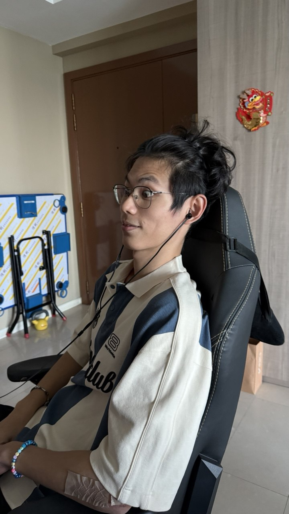
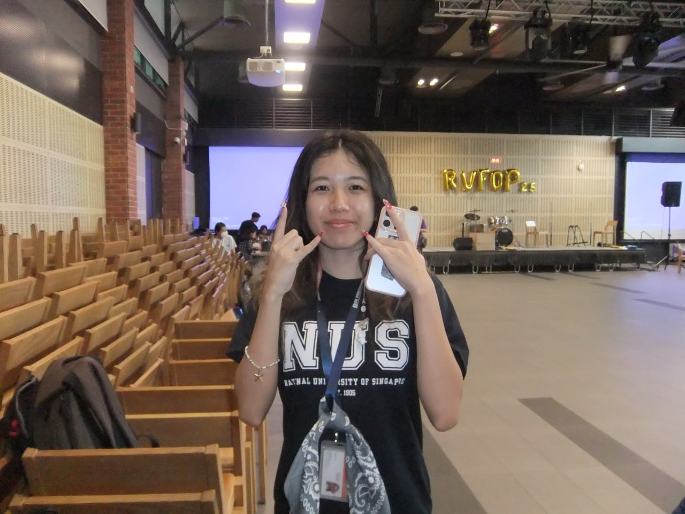
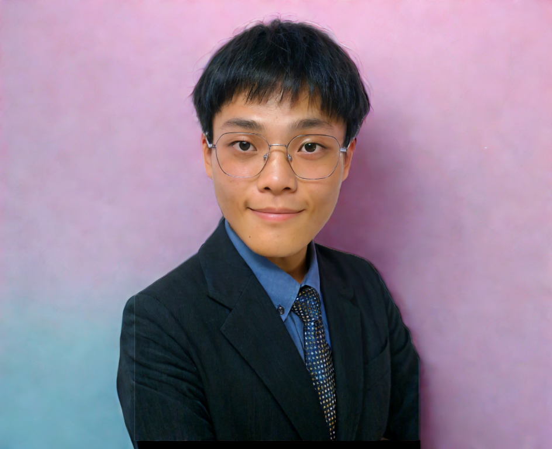
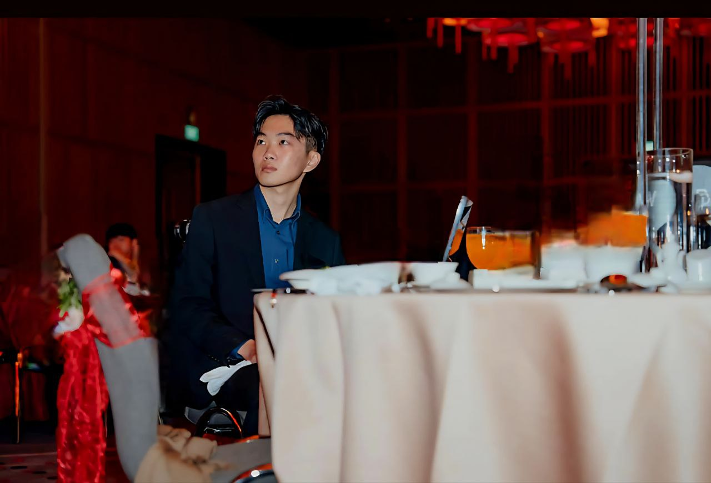

We are a team based in the [School of Computing, National University of Singapore](https://www.comp.nus.edu.sg).

You can reach us at the email `seer[at]comp.nus.edu.sg`

## Project team

### Gene Hern

[[homepage](http://www.comp.nus.edu.sg/~damithch)]
[[github](https://github.com/genehern)]
[[portfolio](team/genehern.md)]

* Role: Team Lead
* Responsibilities: Data

### Stelle

[[github](http://github.com/stellecodes)]
[[portfolio](team/stelle.md)]

* Role: Team Lead
* Responsibilities: UI

### Congchen

[[github](http://github.com/xiao-congchen)] [[portfolio](team/congchen.md)]

* Role: Developer
* Responsibilities: Data

### Wee Jean

[[github](http://WeeJean.com/)]
[[portfolio](team/weejean.md)]

* Role: Developer
* Responsibilities: Dev Ops + Threading

### James Doe

[[github](http://github.com/YH-100203)]
[[portfolio](team/YingHeng.md)]

* Role: Developer
* Responsibilities: UI
