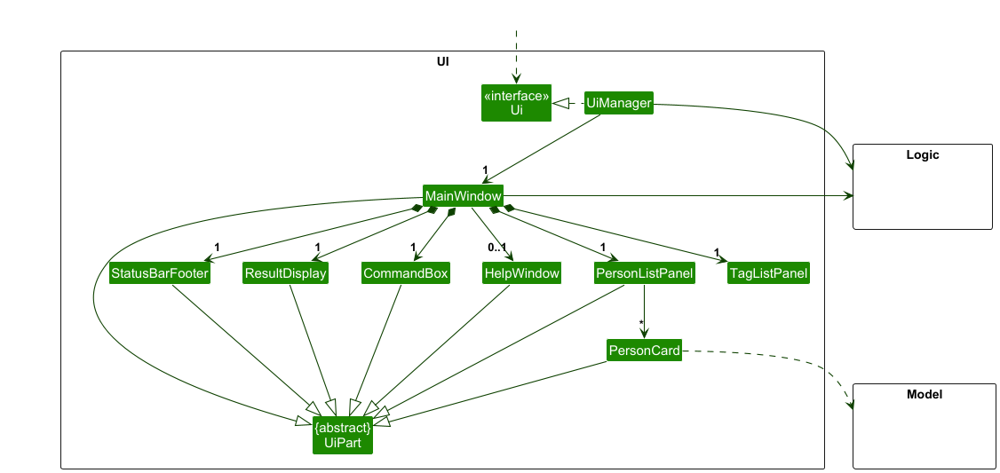
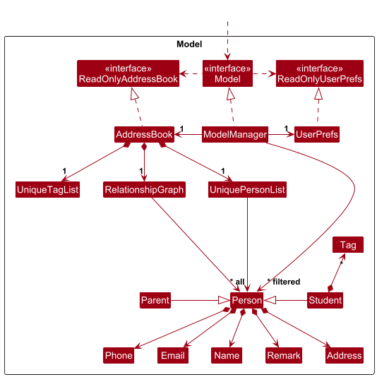
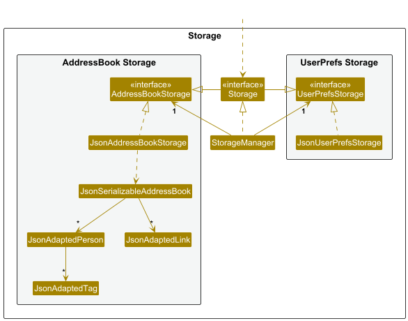

* Table of Contents
{:toc}

--------------------------------------------------------------------------------------------------------------------

## **Acknowledgements**

* {list here sources of all reused/adapted ideas, code, documentation, and third-party libraries -- include links to the original source as well}
* This project is based on the AddressBook-Level3 project created by the [SE-EDU initiative](https://se-education.org).

--------------------------------------------------------------------------------------------------------------------

## **Setting up, getting started**

Refer to the guide [_Setting up and getting started_](SettingUp.md).

--------------------------------------------------------------------------------------------------------------------

## **Design**

:bulb: **Tip:** The `.puml` files used to create diagrams are in this document `docs/diagrams` folder. Refer to the [_PlantUML Tutorial_ at se-edu/guides](https://se-education.org/guides/tutorials/plantUml.html) to learn how to create and edit diagrams.

### Architecture

The ***Architecture Diagram*** given above explains the high-level design of the App.

Given below is a quick overview of main components and how they interact with each other.

**Main components of the architecture**

**`Main`** (consisting of classes [`Main`](https://github.com/se-edu/addressbook-level3/tree/master/src/main/java/seedu/address/Main.java) and [`MainApp`](https://github.com/se-edu/addressbook-level3/tree/master/src/main/java/seedu/address/MainApp.java)) is in charge of the app launch and shut down.
* At app launch, it initializes the other components in the correct sequence, and connects them up with each other.
* At shut down, it shuts down the other components and invokes cleanup methods where necessary.

The bulk of the app's work is done by the following four components:

* [**`UI`**](#ui-component): The UI of the App.
* [**`Logic`**](#logic-component): The command executor.
* [**`Model`**](#model-component): Holds the data of the App in memory.
* [**`Storage`**](#storage-component): Reads data from, and writes data to, the hard disk.

[**`Commons`**](#common-classes) represents a collection of classes used by multiple other components.

**How the architecture components interact with each other**

The *Sequence Diagram* below shows how the components interact with each other for the scenario where the user issues the command `delete 1`.

Each of the four main components (also shown in the diagram above),

* defines its *API* in an `interface` with the same name as the Component.
* implements its functionality using a concrete `{Component Name}Manager` class (which follows the corresponding API `interface` mentioned in the previous point.

For example, the `Logic` component defines its API in the `Logic.java` interface and implements its functionality using the `LogicManager.java` class which follows the `Logic` interface. Other components interact with a given component through its interface rather than the concrete class (reason: to prevent outside component's being coupled to the implementation of a component), as illustrated in the (partial) class diagram below.

The sections below give more details of each component.

### UI component

The **API** of this component is specified in [`Ui.java`](https://github.com/se-edu/addressbook-level3/tree/master/src/main/java/seedu/address/ui/Ui.java)

The UI consists of a `MainWindow` that is made up of parts e.g.`CommandBox`, `ResultDisplay`, `PersonListPanel`, `StatusBarFooter` etc. All these, including the `MainWindow`, inherit from the abstract `UiPart` class which captures the commonalities between classes that represent parts of the visible GUI.

The `UI` component uses the JavaFx UI framework. The layout of these UI parts are defined in matching `.fxml` files that are in the `src/main/resources/view` folder. For example, the layout of the [`MainWindow`](https://github.com/se-edu/addressbook-level3/tree/master/src/main/java/seedu/address/ui/MainWindow.java) is specified in [`MainWindow.fxml`](https://github.com/se-edu/addressbook-level3/tree/master/src/main/resources/view/MainWindow.fxml)

The `UI` component,

* executes user commands using the `Logic` component.
* listens for changes to `Model` data so that the UI can be updated with the modified data.
* keeps a reference to the `Logic` component, because the `UI` relies on the `Logic` to execute commands.
* depends on some classes in the `Model` component, as it displays `Person` object residing in the `Model`.

### Logic component

**API** : [`Logic.java`](https://github.com/se-edu/addressbook-level3/tree/master/src/main/java/seedu/address/logic/Logic.java)

Here's a (partial) class diagram of the `Logic` component:

The sequence diagram below illustrates the interactions within the `Logic` component, taking `execute("delete 1")` API call as an example.

:information_source: **Note:** The lifeline for `DeleteCommandParser` should end at the destroy marker (X) but due to a limitation of PlantUML, the lifeline continues till the end of diagram.

How the `Logic` component works:

1. When `Logic` is called upon to execute a command, it is passed to an `AddressBookParser` object which in turn creates a parser that matches the command (e.g., `DeleteCommandParser`) and uses it to parse the command.
1. This results in a `Command` object (more precisely, an object of one of its subclasses e.g., `DeleteCommand`) which is executed by the `LogicManager`.
1. The command can communicate with the `Model` when it is executed (e.g. to delete a person). 
   Note that although this is shown as a single step in the diagram above (for simplicity), in the code it can take several interactions (between the command object and the `Model`) to achieve.
1. The result of the command execution is encapsulated as a `CommandResult` object which is returned back from `Logic`.

Here are the other classes in `Logic` (omitted from the class diagram above) that are used for parsing a user command:

How the parsing works:
* When called upon to parse a user command, the `AddressBookParser` class creates an `XYZCommandParser` (`XYZ` is a placeholder for the specific command name e.g., `AddCommandParser`) which uses the other classes shown above to parse the user command and create a `XYZCommand` object (e.g., `AddCommand`) which the `AddressBookParser` returns back as a `Command` object.
* All `XYZCommandParser` classes (e.g., `AddCommandParser`, `DeleteCommandParser`, ...) inherit from the `Parser` interface so that they can be treated similarly where possible e.g, during testing.

### Model component
**API** : [`Model.java`](https://github.com/se-edu/addressbook-level3/tree/master/src/main/java/seedu/address/model/Model.java)

The `Model` component,

* stores the address book data i.e., all `Person` objects (which are contained in a `UniquePersonList` object).
* stores the currently 'selected' `Person` objects (e.g., results of a search query) as a separate _filtered_ list which is exposed to outsiders as an unmodifiable `ObservableList<Person>` that can be 'observed' e.g. the UI can be bound to this list so that the UI automatically updates when the data in the list change.
* stores a `UserPref` object that represents the user’s preferences. This is exposed to the outside as a `ReadOnlyUserPref` objects.
* does not depend on any of the other three components (as the `Model` represents data entities of the domain, they should make sense on their own without depending on other components)

:information_source: **Note:** An alternative (arguably, a more OOP) model is given below. It has a `Tag` list in the `AddressBook`, which `Person` references. This allows `AddressBook` to only require one `Tag` object per unique tag, instead of each `Person` needing their own `Tag` objects. 

### Storage component

**API** : [`Storage.java`](https://github.com/se-edu/addressbook-level3/tree/master/src/main/java/seedu/address/storage/Storage.java)

The `Storage` component,
* can save both address book data and user preference data in JSON format, and read them back into corresponding objects.
* inherits from both `AddressBookStorage` and `UserPrefStorage`, which means it can be treated as either one (if only the functionality of only one is needed).
* depends on some classes in the `Model` component (because the `Storage` component's job is to save/retrieve objects that belong to the `Model`)

### Common classes

Classes used by multiple components are in the `seedu.address.commons` package.

--------------------------------------------------------------------------------------------------------------------

## **Documentation, logging, testing, configuration, dev-ops**

* [Documentation guide](Documentation.md)
* [Testing guide](Testing.md)
* [Logging guide](Logging.md)
* [Configuration guide](Configuration.md)
* [DevOps guide](DevOps.md)

--------------------------------------------------------------------------------------------------------------------

## **Appendix: Requirements**

### Product scope

**Target user profile**:

* private tutors
* teaching multiple small groups or  across academic levels
* has a need to manage a significant number of contacts
* prefer desktop apps over other types
* can type fast
* prefers typing to mouse interactions
* is reasonably comfortable using CLI apps

**Value proposition**: Quickly **organize** and **find** the intended student/parent contact.  
No more digging through a messy contact list — keep lessons running smoothly with clear, structured communication!

### User stories

Priorities: High (must have) - `* * *`, Medium (nice to have) - `* *`, Low (unlikely to have) - `*`

| Priority | As a …                        | I want to …               | So that I can…                                                 |
| -------- |-------------------------------| ------------------------- | -------------------------------------------------------------- |
| `* * *`  | tutor                         | add a new student contact | keep track of the student’s details easily                     |
| `* * *`  | tutor                         | add a new parent contact  | keep track of the student’s parents’ details easily            |
| `* * *`  | tutor                         | delete a student’s contact | keep my list clean and up to date                              |
| `* * *`  | tutor                         | delete a parent’s contact | keep my list clean and up to date                              |
| `* * *`  | tutor                         | link a student contact with a parent contact | understand and manage their relationship                       |
| `* * *`  | tutor                         | find a parent’s contact from a student’s contact | contact the parent even when I only have the student’s details |
| `* * *`  | tutor                         | search by student name    | find a student’s information faster                            |
| `* * *`  | tutor                         | search by parent name     | find a parent’s information faster                             |
| `* *`    | tutor with many students      | tag students with their level | manage students based on their level                           |
| `* *`    | tutor with many students      | tag students with their subject | manage and track students by their subjects                    |
| `* *`    | tutor with many students      | find all linked contacts (e.g., parents of a student, students of a parent) | easily view relationships without searching manually                                                        |
| `* *`    | tutor with many students      | tag students with their grades | identify students who need more attention                      |
| `* *`    | tutor with many students      | tag students by their classes | manage students who are in the same class                      |
| `* *`    | tutor                         | update tags without affecting current tags | make changes without disrupting existing data                  |
| `* *`    | tutor with a lot of classes   | retrieve contact info of all students in the same class | send class announcements to students quickly                   |
| `* *`    | tutor                         | see students’ and parents’ contacts side by side | choose the right person to contact                             |
| `* *`    | tutor with a lot of classes   | retrieve contact info of all parents of students in the same class | send class announcements to parents quickly                    |
| `* *`    | tutor                         | search for students by level/subject/grades | target specific students more easily                           |
| `* *`    | tutor                         | record the preferred communication method for each contact | reach students/parents effectively                             |
| `* *`    | tutor                         | keep short notes for each contact | recall important attributes or situations                      |
| `* *`    | new tutor                     | access a help page        | learn how to use the app                                       |
| `* *`    | new tutor                     | see sample data on first launch | familiarise myself with the functionalities                    |
| `*`      | tutor                         | pin certain contacts to the top | quickly find contacts I contact often                          |
| `*`      | tutor returning after a while | access a refresher tutorial on launch | get back up to speed quickly                                   |

### Use cases

(For all use cases below, the **System** is `ClassConnect` and the **Actor** is the `user`, unless specified otherwise)

---

**Use case: Add a student contact**

**MSS**

1. User requests to add a student with details.
2. System validates the details and checks for duplicates.
3. System adds the student and acknowledges success.

   Use case ends.

**Extensions**

* 2a. Details are invalid.
    * 2a1. System presents the validation issue.
    * 2a2. User revises the details (returns to Step 2).

* 2b. A matching student already exists.
    * 2b1. System reports the duplicate and aborts.

      Use case ends.

---

**Use case: Add a parent contact**

Similar to adding a student contact except that tags will be an invalid field for parent contacts.

---

**Use case: Edit a contact**

**MSS**

1. User requests to edit a contact with details.
2. System validates the details.
3. System updates the contact and acknowledges success.

   Use case ends.

**Extensions**

* 2a. Details are invalid.
    * 2a1. System presents the validation issue.
    * 2a2. User revises the details (returns to Step 2).

---

**Use case: Delete a contact**

**MSS**
1. User requests to delete a contact using either an index or identifiers.
2. System validates the request:
    * 2.1. If an index is provided, system checks that it exists in the current list.
    * 2.2. If identifiers are provided, system searches for matching contact(s).
3. If exactly one contact matches, the system deletes that contact and acknowledges success.

   Use case ends.

**Extensions**
* 2a. No contact matches.
    * 2a1. System informs the user: “No person found matching the provided identifiers.”

      Use case ends.

* 2b. Multiple contacts match.
    * 2b1. System reports ambiguity and requests additional identifiers.

      Use case ends.

* 2c. User provides both index and identifiers.
    * 2c1. System rejects the command with a format error message.

      Use case ends.

---

**Use case: Filter by tags**

**MSS**
1. User requests to filter students by one or more tag keywords (e.g., filter Math or filter Math Chem).
2. System validates the command format (non-empty, whitespace-separated keywords).
3. System checks each keywordIf at least one known tag remains, System applies the filter to students only (parents are excluded) using OR-semantics (a student is shown if they have any of the known tags). 
4. System displays the filtered list and a success message indicating the number of students and the tag(s) used. 
5. If some requested tags are unknown, System appends a note indicating those tags were ignored.

   Use case ends.

**Extensions**
* 2a. Command format invalid (e.g., empty input, only spaces).
    * 2a1. System shows usage message for filter.

      Use case ends.

* 3a. All requested tags are unknown (not in master tag registry).
    * 3a1. System informs:
      * “The tag ‘X’ does not exist …” or
      * • “These tags do not exist: X, Y …”
    * 3a2. No filtering applied; current list remains unchanged. Use case ends.
    
      Use case ends.

* 4a. Known tags provided but no student currently has them.
    * 4a1. System applies filter and shows: “Listed 0 persons with tag(s): …”.

      Use case ends.

* 4b. Extra spaces in keywords.
    * 4b1. System trims spaces. (Continue at Step 4.)

---

**Use case: Link a student with a parent**

**MSS**

1. User requests to link a specific student with a specific parent.
2. System verifies that both contacts exist and that the link is valid and new.
3. System creates the link and acknowledges success.

   Use case ends.

**Extensions**

* 2a. Student does not exist.
    * 2a1. System reports the missing student.

      Use case ends.

* 2b. Parent does not exist.
    * 2b1. System reports the missing parent.

      Use case ends.

* 2c. Link already exists or is invalid.
    * 2c1. System reports the issue and aborts.

      Use case ends.

---

**Use case: Unlink a student from a parent**

**MSS**

1. User requests to unlink a specific student from a specific parent.
2. System verifies that both contacts exist and that the link currently exists.
3. System removes the link and acknowledges success.

   Use case ends.

**Extensions**

* 2a. One or both contacts do not exist.
    * 2a1. System reports the missing contact(s).

      Use case ends.

* 2b. No such link exists.
    * 2b1. System reports that the relationship is absent.

      Use case ends.

* 3a. User cancels unlinking.
    * 3a1. System aborts the operation.

      Use case ends.

---

**Use case: Find linked contacts**

**MSS**
1. User requests to view all contacts linked to a specific student or parent.
2. System verifies that the specified contact exists and has valid links.
3. System displays all linked contacts.

   Use case ends.

**Extensions**
* 2a. No contact matches the provided identifiers.
    * 2a1. System informs the user that no matching contact was found.

      Use case ends.

* 2b. The contact exists but has no links.
    * 2b1. System reports that no linked contacts were found.

      Use case ends.

---

**Use case: Save data (auto-save)**

**MSS**

1. User completes an operation that changes stored data.
2. System persists the updated data and continues operation.

   Use case ends.

**Extensions**

* 2a. Persistence fails.
    * 2a1. System warns about the failure.

      Use case ends.

---

**Use case: Exit the program**

**MSS**

1. User requests to close the application.
2. System saves current data and terminates.

   Use case ends.

**Extensions**

* 2a. Saving fails.
    * 2a1. System warns about unsaved changes and proceeds or aborts per policy.

      Use case ends.

### Non-Functional Requirements

1.  Should work on any _mainstream OS_ as long as it has Java `17` or above installed.
2.  Should be able to hold up to 1000 persons without a noticeable sluggishness in performance for typical usage.
3.  A user with above average typing speed for regular English text (i.e. not code, not system admin commands) should be able to accomplish most of the tasks faster using commands than using the mouse.
4.  Should not depend on a DBMS or remote server for core operations.
5.  Should be packaged into a single executable JAR file ≤ 100 MB, without requiring an installer.
6.  Should run without OS-specific dependencies, allowing platform-independent execution.
7.  Should display all functions correctly at 1920×1080 resolution (100%/125% scaling) and remain usable at 1280×720 resolution (150% scaling).
8.  Should follow an object-oriented design so that new commands can be added with minimal changes to existing code.
9. Should remain a single-user application, preventing simultaneous or shared multi-user access to data files.
10. Should store data locally in a human-editable text file (JSON format), and recover gracefully by starting with an empty dataset if the file is corrupted.

### Glossary

* **Address Book**: The core dataset of the app that stores all Student and Parent.
* **Command**: A typed instruction from the user that tells the app to perform an action (e.g., adding a contact, finding someone, linking a parent and student).
* **CommandResult**: The object returned after executing a Command, containing feedback and optional instructions for the UI.
* **Command Line Interface**: A text-based interface where users type commands instead of using buttons or menus.
* **Command Parser**: A class that reads and interprets the text the user types, then creates the appropriate Command object to execute the action.
* **Error Message**: A message shown when a command cannot be executed or fails validation.
* **JAR File**: A packaged Java application that can be run directly.
* **JSON (JavaScript Object Notation)**: A lightweight text format used to save and load data on disk.
* **Mainstream OS**: Windows, Linux, Unix, MacOS.
* **Link (Student-Parent)**: A data relationship between a Student and a Parent contact to reflect real-world connections.
* **Logic Component**: The part of the system that parses and executes commands. It connects user input to the Model and Storage.
* **Main**: The entry point of the application. Initialises all components in the correct order during startup and handles shutdown.
* **Model Component**: The in-memory representation of the app's data.
* **Parent Contact**: A Person entry representing a parent or guardian, usually linked to one or more students.
* **Parser**: A general interface implemented by all command parsers, ensuring a consistent way to interpret user commands.
* **Person**: The base data entity representing any contact (student or parent) in the address book.
* **Private contact detail**: A contact detail that is not meant to be shared with others
* **Storage Component**: Responsible for reading from and writing to files on the disk. Uses JSON to persist address book data.
* **Student Contact**: A Person entry representing a student taught by the tutor.
* **Tag**: A label that can be attached to contacts (e.g., “Math”, “Sec2”, “ClassA”) to help categorize, search, and manage them efficiently.
* **UI (User Interface) component**: The part of the app that displays information and receives user input. Although the app is CLI-driven, it uses JavaFX under the hood.
* **UniquePersonList**: A data structure that ensures there are no duplicate Person entries in the address book.
* **Undo / Redo**: Features that allow reversing the last action (undo) or reapplying an undone action (redo).
* **User Preferences (UserPrefs)**: Configuration information stored per user, such as file paths and window size.

--------------------------------------------------------------------------------------------------------------------

## **Appendix: Instructions for manual testing**

Given below are instructions to test the app manually.

:information_source: **Note:** These instructions only provide a starting point for testers to work on;
testers are expected to do more *exploratory* testing.

### Launch and shutdown

1. Initial launch

   1. Download the jar file and copy into an empty folder

   2. Double-click the jar file Expected: Shows the GUI with a set of sample contacts. The window size may not be optimum.

2. Saving window preferences

   1. Resize the window to an optimum size. Move the window to a different location. Close the window.

   2. Re-launch the app by double-clicking the jar file. 
       Expected: The most recent window size and location is retained.

3. _{ more test cases …​ }_

### Deleting a person

1. Deleting a person while all persons are being shown

   1. Prerequisites: List all persons using the `list` command. Multiple persons in the list.

   2. Test case: `delete 1` 
      Expected: First contact is deleted from the list. Details of the deleted contact shown in the status message. Timestamp in the status bar is updated.

   3. Test case: `delete 0` 
      Expected: No person is deleted. Error details shown in the status message. Status bar remains the same.

   4. Other incorrect delete commands to try: `delete`, `delete x`, `...` (where x is larger than the list size) 
      Expected: Similar to previous.

1. Deleting by identifiers (name/email/phone)

   1. Test case: `delete n/John Doe` 
      Expected: The contact whose name matches “John Doe” (case-insensitive) is deleted. Success message shows the deleted person’s details.

   2. Test case: `delete e/alice@example.com` 
      Expected: The contact with the given email address is deleted. Success message confirms deletion.

   3. Test case: `delete p/91234567` 
      Expected: The contact with the given phone number is deleted. Success message confirms deletion.

   4. Test case: `delete n/John Tan e/john.tan@example.com` 
      Expected: Deletes the specific “John Tan” whose email matches the provided address. This helps when multiple persons share the same name. Success message confirms deletion.

   5. Test case: `delete n/John` (ambiguous input) 
      Expected: No person is deleted. Error message shown: “Multiple persons match the given identifiers. Please provide more identifiers to specify the person.”

   6. Test case: `delete n/Nonexistent Name` 
      Expected: No person is deleted. Error message shown: “No person found matching the provided identifiers.”

   7. Test case: `delete 1 n/John Doe` 
      Expected: No person is deleted. Error message shown: “You may use either the index form or identifier form — not both.”

   8. Test case: `delete n/` 
      Expected: Error message shown: “Invalid command format. Identifier cannot be empty.” No data modified.

### Linking contacts

1. Links a student and a parent together to represent a relationship (e.g., a tutor linking a student to their parent).

    1. **Prerequisites:**  
       Ensure that both the student and parent contacts already exist in the address book.  
       For example, `adds n/John Tan p/98765432 e/john@example.com a/Blk 1 t/Math` and  
       `addp n/Mrs Tan p/92345678 e/mrs.tan@example.com a/Blk 1`.

    2. **Test case:** `link sn/John Tan pn/Mrs Tan`  
       Expected: Success message — “Linked John Tan ↔ Mrs Tan”.  
       Both contacts now appear as linked when you use the `findlink n/John Tan` command.

    3. **Test case:** `link sn/Mrs Tan pn/John Tan`  
       Expected: Error message — “Student contact not found or is not of type Student.”  
       The command enforces valid pairing (sn/Student ↔ pn/Parent only).

    4. **Test case:** `link sn/John Tan pn/John Tan`  
       Expected: Error message — “Student contact not found or is not of type Student.”

    5. **Test case:** `link sn/John Tan pn/Nonexistent Parent`  
       Expected: Error message — “Parent contact not found or is not of type Parent.”

    6. **Test case:** `link sn/Nonexistent Student pn/Mrs Tan`  
       Expected: Error message — “Student contact not found or is not of type Student.”

    7. **Test case:** `link sn/John Tan pn/Mrs Tan` (repeat twice)  
       Expected: Error message — “These contacts are already linked.”

    8. **Test case:** Link the same student to two parents (`link sn/John Tan pn/Mrs Tan`, then `link sn/John Tan pn/Mr Tan`)  
       Expected: Success message for both commands.  
       Attempting a third parent link (`link sn/John Tan pn/Uncle Tan`)  
       shows: “Each student can only be linked to up to 2 parents.”

### Unlinking contacts

1. Removes an existing student–parent link.

    1. **Prerequisites:**  
       The student and parent must already be linked using the `link` command.

    2. **Test case:** `unlink sn/John Tan pn/Mrs Tan`  
       Expected: Success message — “Unlinked John Tan ↔ Mrs Tan”.  
       Running `findlink n/John Tan` afterward shows that the parent contact no longer appears.

    3. **Test case:** `unlink sn/John Tan pn/Nonexistent Parent`  
       Expected: Error message — “Parent contact not found or is not of type Parent.”

    4. **Test case:** `unlink sn/Nonexistent Student pn/Mrs Tan`  
       Expected: Error message — “Student contact not found or is not of type Student.”

    5. **Test case:** `unlink sn/John Tan pn/Mr Tan` where they were never linked  
       Expected: Error message — “These contacts are not currently linked.”

### Finding linked contacts

1. Displays all contacts that are linked to a given person (e.g., showing all parents linked to a student, or vice versa).

   1. Test case: `findlink n/John Doe` 
      Expected: Lists all contacts linked to “John Doe”. Message: Showing X linked contact(s) for John Doe.

   2. Test case: `findlink n/Nonexistent Name` 
      Expected: Error: No person found with the name: Nonexistent Name.

   3. Other incorrect delete commands to try: `findlink`, `findlink n/`, `findlink 1`, `findlink n/John n/Jane`,  `findlink randomtext n/John` 
      Expected: Error: Invalid command format. Usage: findlink n/NAME.

### Saving data

1. Dealing with missing/corrupted data files

   1. _{explain how to simulate a missing/corrupted file, and the expected behavior}_

2. _{ more test cases …​ }_
