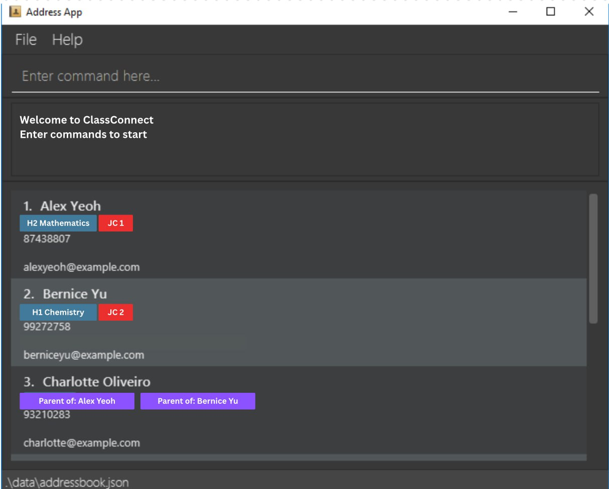
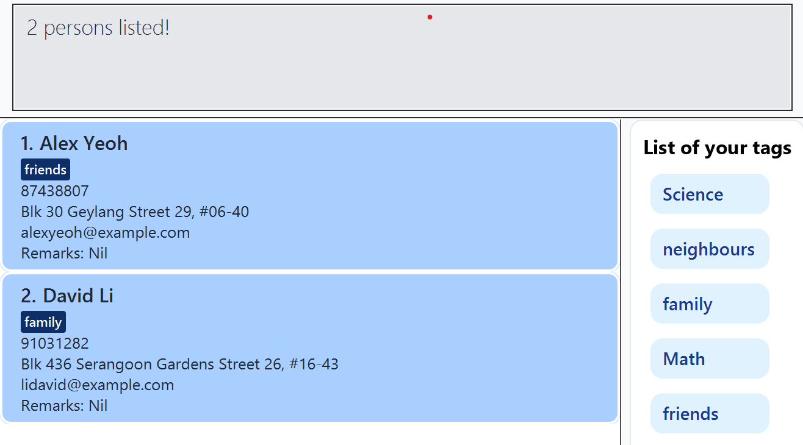

AddressBook Level 3 (AB3) is a **desktop app for managing contacts, optimized for use via a Command Line Interface** (CLI) while still having the benefits of a Graphical User Interface (GUI). If you can type fast, AB3 can get your contact management tasks done faster than traditional GUI apps.

* Table of Contents
{:toc}

--------------------------------------------------------------------------------------------------------------------

## Quick start

1. Ensure you have Java `17` or above installed in your Computer. 
   **Mac users:** Ensure you have the precise JDK version prescribed [here](https://se-education.org/guides/tutorials/javaInstallationMac.html).

1. Download the latest `.jar` file from [here](https://github.com/se-edu/addressbook-level3/releases).

1. Copy the file to the folder you want to use as the _home folder_ for your AddressBook.

1. Open a command terminal, `cd` into the folder you put the jar file in, and use the `java -jar addressbook.jar` command to run the application. 
   A GUI similar to the below should appear in a few seconds. Note how the app contains some sample data. 
   

1. Type the command in the command box and press Enter to execute it. e.g. typing **`help`** and pressing Enter will open the help window. 
   Some example commands you can try:

   * Lists all contacts: `list`

   * Add contacts:
     * Adds a student named `John` with tag `Math` to the Address Book:
       * `adds n/John p/98765432 e/johnd@example.com a/John street, block 123, #01-01 r/Hate school t/Math`
     * Adds a parent named `Jane` to the Address Book:
       * `addp n/Jane p/87654321 2/jane@example.com a/Jane street, block 321, #01-01 r/Love John`
   * Find all contacts with names containing `John`: `find John`
    
   * Deletes the 3rd contact shown in the current list: `delete 3`.

   * `clear` : Deletes all contacts.

   * `exit` : Exits the app.

1. Refer to the [Features](#features) below for details of each command.

--------------------------------------------------------------------------------------------------------------------

## Features

**:information_source: Notes about the command format:** 

* Words in `UPPER_CASE` are the parameters to be supplied by the user. 
  e.g. in `add n/NAME`, `NAME` is a parameter which can be used as `add n/John Doe`.

* Items in square brackets are optional. 
  e.g `n/NAME [t/TAG]` can be used as `n/John Doe t/friend` or as `n/John Doe`.

* Items with `…​` after them can be used multiple times including zero times. 
  e.g. `[t/TAG]…​` can be used as ` ` (i.e. 0 times), `t/friend`, `t/friend t/family` etc.

* Parameters can be in any order. 
  e.g. if the command specifies `n/NAME p/PHONE_NUMBER`, `p/PHONE_NUMBER n/NAME` is also acceptable.

* Extraneous parameters for commands that do not take in parameters (such as `help`, `list`, `exit` and `clear`) will be ignored. 
  e.g. if the command specifies `help 123`, it will be interpreted as `help`.

* If you are using a PDF version of this document, be careful when copying and pasting commands that span multiple lines as space characters surrounding line-breaks may be omitted when copied over to the application.

### Viewing help : `help`

Shows a message explaining how to access the help page.

Format: `help`

### Adding a contact: `adds`/`addp`

Adds a student (with `adds`) or a parent (with `addp`) to the address book. 

All contacts contain an **_optional_** `remark` field and the following **_compulsory_** fields:
- `name`
- `phone number`
- `email`
- `address` 

Students contain an additional **_optional_** `tags` field 

:bulb: **Tip:** Only existing tags in the tag list can be added to a student. 
Use the `add_tags` command to add new tags before use.

Format (Parent): `addp n/NAME p/PHONE_NUMBER e/EMAIL a/ADDRESS [r/REMARK]`  
Format (Student): `adds n/NAME p/PHONE_NUMBER e/EMAIL a/ADDRESS [r/REMARK] [t/TAG]…`

:bulb: **Tip:**
A student can have any number of tags (including 0). 
The order of fields does not matter. e.g. `adds p/98765432 n/John Doe...` is also acceptable.

Examples:
* `adds n/John Doe p/98765432 e/johnd@example.com a/John street, block 123, #01-01 t/Math`
* `addp n/Betsy Crowe e/betsycrowe@example.com a/Newgate Prison p/1234567 t/criminal r/Prefers email`

### Listing all contacts : `list`

Shows a list of all contacts in the address book.

Format: `list`

### Editing a contact : `edit`

Edits an existing contact in the address book.

Format: `edit INDEX [n/NAME] [p/PHONE] [e/EMAIL] [a/ADDRESS] [t/TAG]…​`

* Edits the person at the specified `INDEX`. The index refers to the index number shown in the displayed person list. The index **must be a positive integer** 1, 2, 3, …​
* At least one of the optional fields must be provided.
* Existing values will be updated to the input values.
* When editing tags, the existing tags of the person will be replaced.
* You can remove all the person’s tags by typing `t/` without specifying any tags after it.

:bulb: **Tip:**
Only student contacts can have tags, so updates to the tag with `t/` only applies to student contacts. 

Examples:
*  `edit 1 p/91234567 e/johndoe@example.com` Edits the phone number and email address of the 1st person to be `91234567` and `johndoe@example.com` respectively.
*  `edit 2 n/Betsy Crower t/` Edits the name of the 2nd person to be `Betsy Crower` and clears all existing tags.

### Locating contacts by name: `find`

Finds contacts whose names contain any of the given keywords.

Format: `find KEYWORD [MORE_KEYWORDS]`

* The search is case-insensitive. e.g `hans` will match `Hans`
* The order of the keywords does not matter. e.g. `Hans Bo` will match `Bo Hans`
* Only the name is searched.
* Only full words will be matched e.g. `Han` will not match `Hans`
* Persons matching at least one keyword will be returned (i.e. `OR` search).
  e.g. `Hans Bo` will return `Hans Gruber`, `Bo Yang`

Examples:
* `find John` returns `john` and `John Doe`
* `find alex david` returns `Alex Yeoh`, `David Li` 

### Filtering by tags: `filter`

Show students whose have any of the tags given.

Format: `filter tag [MORE_TAGS]`

* The search is case-insensitive. e.g `Math` will match `math`
* The order of the tags does not matter.
* Only the tags are searched.
* Only full words will be matched e.g. `Math` will not match `Mathematics`
* Students with at least one tag will be returned (i.e. `OR` search).

Examples:
* John Doe has Math tag, Peter has Chem and Math tags
* `filter Math` returns `John Doe`
* `filter Math Chem` returns `John Doe` and `Peter`

### Deleting a person : `delete`

Deletes the specified person from the address book.

Format: `delete INDEX` or `delete [n/NAME] [e/EMAIL] [p/PHONE]`

* Deletes the person at the specified INDEX, or deletes the person that matches the provided identifier(s). 
* The index refers to the index number shown in the displayed person list. 
* The index must be a positive integer 1, 2, 3, … 
* When using identifiers:
* `n/NAME` — matches the full name (case-insensitive). 
* `e/EMAIL` — matches the exact email address (case-insensitive). 
* `p/PHONE` — matches the exact phone number. 
* You may combine multiple identifiers (e.g. `n/` + `e/`) to narrow down the match when multiple persons share the same name. 
* You must use either the index form or the identifier form — not both in the same command. 
* If multiple persons match, the app reports that the command is ambiguous and requests you to specify more identifiers. 
* If no match is found, the app will show a no match found message.

Examples:
* `list` followed by `delete 2` deletes the 2nd person in the address book. 
* `find Betsy` followed by `delete 1` deletes the 1st person in the results of the `find` command. 
* `delete n/John Doe` deletes the contact whose name is “John Doe”. 
* `delete e/alice@example.com` deletes the contact with the given email address.
* `delete p/91234567` deletes the contact with that phone number. 
* `delete n/John Tan e/john.tan@example.com` deletes the “John Tan” identified by the provided email.

### Linking a student and parent : `link`
Links an existing student contact with a parent contact, forming a two-way relationship between them.

Format: `link sn/STUDENT_NAME [sp/STUDENT_PHONE] pn/PARENT_NAME [pp/PARENT_PHONE]`

* `sn/` — name of the student contact (required)
* `sp/` — phone number of the student (optional, used for disambiguation)
* `pn/` — name of the parent contact (required)
* `pp/` — phone number of the parent (optional, used for disambiguation)
* 
Examples:
* `link sn/John Tan pn/Mrs Tan` Links student John Tan with parent Mrs Tan.
* `link sn/Aisha Lim sp/91234567 pn/Mr Lim pp/92345678` Links the student and parent when there are duplicate names.

Notes:
* A student can be linked to multiple parents (e.g., mother and father).
* A parent can be linked to multiple students (e.g., siblings).
* Links are bidirectional — linking a student to a parent automatically links the parent to that student.
* Link relationships are automatically saved in the data file and reloaded when the app restarts.
* Deleting a contact automatically removes all links associated with that contact.

### Unlinking a student and parent : `unlink`
Removes an existing link between a student and a parent contact.

Format: `unlink sn/STUDENT_NAME [sp/STUDENT_PHONE] pn/PARENT_NAME [pp/PARENT_PHONE]`

* `sn/` — name of the student contact (required)
* `sp/` — phone number of the student (optional, used for disambiguation)
* `pn/` — name of the parent contact (required)
* `pp/` — phone number of the parent (optional, used for disambiguation)

Examples:
* unlink sn/John Tan pn/Mrs Tan `Removes the link between John Tan and Mrs Tan.`
* unlink sn/Aisha Lim sp/91234567 pn/Mr Lim pp/92345678 `Removes a specific link if there are duplicate names.`

### Finding linked contacts : `findlink`

Finds and displays all contacts that are linked to a specified person.

Format: `findlink n/NAME`

* Shows all persons who are linked to the specified person. 
  For example, if a student is linked to their parents, this command will display the parents’ contacts.
* The search by `NAME` is case-insensitive and must match the person’s full name exactly.
  (e.g. `findlink n/Alice Tan`, `findlink n/aLiCe tAn` both refer to the same contact.)
* You must include the `n/` prefix when specifying the name. 
* If the specified person has no linked contacts, the command will show that there are 0 linked results. 
* If the specified name does not exist in the address book, an error message will be displayed.

Examples:
* `findlink n/Alice Tan` shows all contacts linked to Alice Tan (e.g. her parents).
* `findlink n/Tom Tan` shows all contacts linked to Tom Tan (e.g. his children).
* `findlink n/Bob Lee` shows “0 linked contact(s)” if Bob Lee has no linked persons.
* `findlink n/Nonexistent Person` shows an error message indicating that no such person exists.

### Clearing all entries : `clear`

Clears all entries from the address book.

Format: `clear`

### Tag management
#### Adding tags : `add_tags t/[TAG] t/[TAG]`
*Adds more possible tags to use
*Possible to add multiple tags at once

#### Deleting tags : `delete_tags t/[TAG] t/[TAG]`
*Deletes a tag type from the possible tags list. This will also delete the tag from all contacts who have this tag.
*Possible to delete multiple tags at once

#### Listing all tags : `list_tags`
*Lists all possible tags that can be used to tag students

### Exiting the program : `exit`

Exits the program.

Format: `exit`

### Saving the data

AddressBook data are saved in the hard disk automatically after any command that changes the data. There is no need to save manually.

### Editing the data file

AddressBook data are saved automatically as a JSON file `[JAR file location]/data/addressbook.json`. Advanced users are welcome to update data directly by editing that data file.

:exclamation: **Caution:**
If your changes to the data file makes its format invalid, AddressBook will discard all data and start with an empty data file at the next run. Hence, it is recommended to take a backup of the file before editing it. 
Furthermore, certain edits can cause the AddressBook to behave in unexpected ways (e.g., if a value entered is outside of the acceptable range). Therefore, edit the data file only if you are confident that you can update it correctly.

--------------------------------------------------------------------------------------------------------------------

## FAQ

**Q**: How do I transfer my data to another Computer? 
**A**: Install the app in the other computer and overwrite the empty data file it creates with the file that contains the data of your previous AddressBook home folder.

--------------------------------------------------------------------------------------------------------------------

## Known issues

1. **When using multiple screens**, if you move the application to a secondary screen, and later switch to using only the primary screen, the GUI will open off-screen. The remedy is to delete the `preferences.json` file created by the application before running the application again.
2. **If you minimize the Help Window** and then run the `help` command (or use the `Help` menu, or the keyboard shortcut `F1`) again, the original Help Window will remain minimized, and no new Help Window will appear. The remedy is to manually restore the minimized Help Window.

--------------------------------------------------------------------------------------------------------------------

## Command summary

Action | Format, Examples
--------|------------------
**Adds** | `adds n/NAME p/PHONE_NUMBER e/EMAIL a/ADDRESS [t/TAG]…​`   e.g., `adds n/James Ho p/22224444 e/jamesho@example.com a/123, Clementi Rd, 1234665 t/Math`
**Addp** | `addp n/NAME p/PHONE_NUMBER e/EMAIL a/ADDRESS [r/REMARK]​`   e.g., `addp n/Jane Doe p/87654321 e/janedoe@example.com a/321, Jurong West St 74 r/Avail on weekends`
**Clear** | `clear`
**Delete** | `delete INDEX or delete [n/NAME] [e/EMAIL] [p/PHONE]`   e.g., `delete 3, delete n/Alex Yeoh, delete e/alex@example.com, delete n/Alex Yeoh e/alex@example.com`
**Edit** | `edit INDEX [n/NAME] [p/PHONE_NUMBER] [e/EMAIL] [a/ADDRESS] [t/TAG]…​`  e.g.,`edit 2 n/James Lee e/jameslee@example.com`
**Find** | `find KEYWORD [MORE_KEYWORDS]`  e.g., `find James Jake`
**Link** | `link sn/STUDENT_NAME [sp/STUDENT_PHONE] pn/PARENT_NAME [pp/PARENT_PHONE]`   e.g., `link sn/John Tan pn/Mrs Tan`
**Unlink** | `unlink sn/STUDENT_NAME [sp/STUDENT_PHONE] pn/PARENT_NAME [pp/PARENT_PHONE]`   e.g., `unlink sn/John Tan pn/Mrs Tan`
**FindLink** | `findlink n/NAME`  e.g., `findlink n/Alice Tan`
**Add_tags** | `add_tags t/[TAG]`  e.g., `add_tags n/Math`
**Delete_tags** | `delete_tags t/[TAG]`  e.g., `delete_tags t/Math`
**List_tags** | `list_tags`
**Filter** | `filter TAG [MORE_TAGS]`  e.g., `filter Math Science`
**List** | `list`
**Help** | `help`
