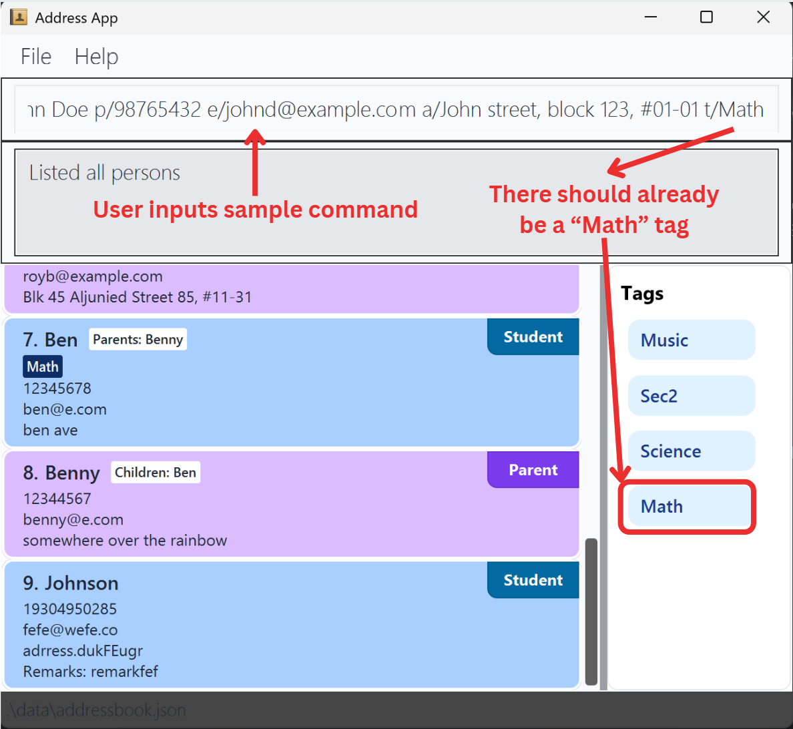
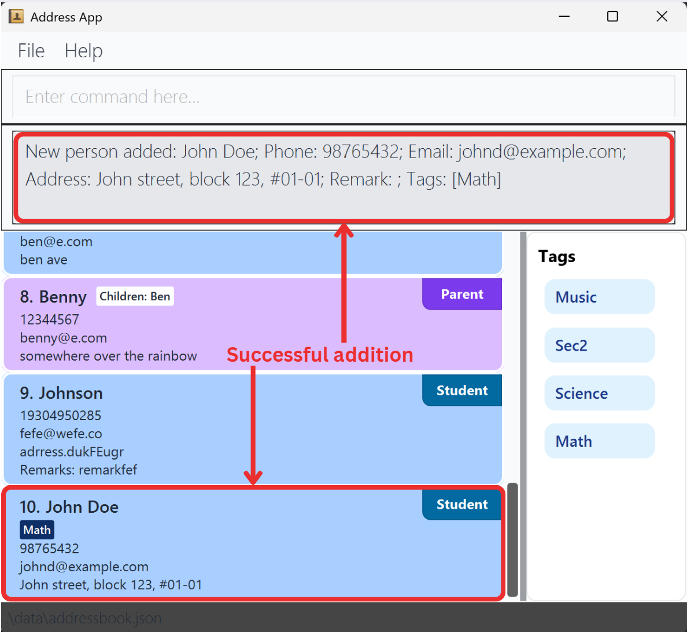
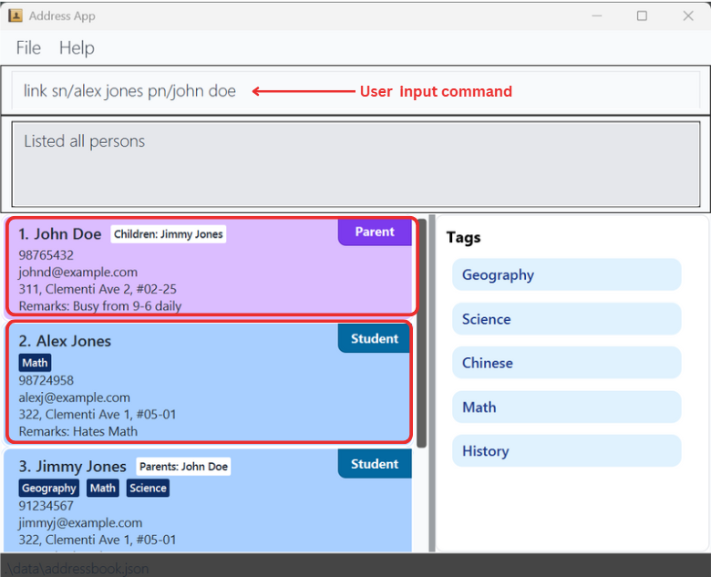
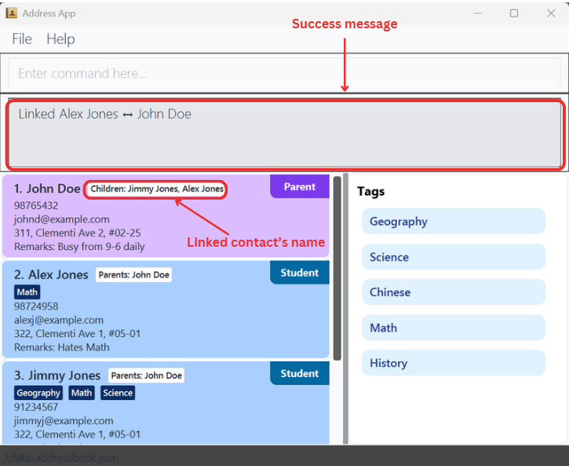
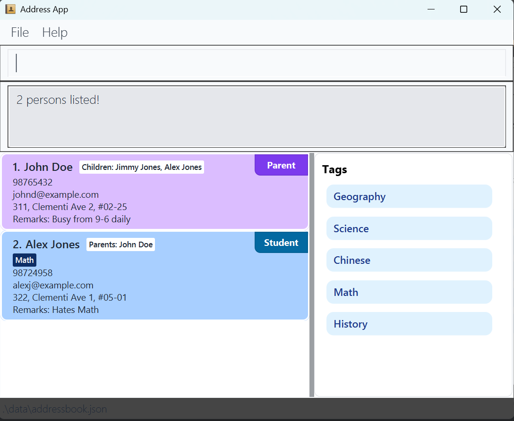

**ClassConnect** is a **desktop application** designed for **private tuition teachers** to efficiently manage their contacts.  
It helps tutors organize information about their **students and their parents**, keeping communication and record-keeping simple and centralized.

## Key Features

- **Add and manage contacts** — Create and update entries for both students and parents.
- **Link students to parents** — Maintain clear relationships between students and their respective parents within the app.
- **Tag students for easy organization** — Assign tags such as `Math`, `P6`, or `Progressing` to categorize students effectively.

--------------------------------------------------------------------------------------------------------------------

## Table of Contents
* [Quick start](#quick-start)
* [Commands](#commands)
* [FAQ](#faq)
* [Current limitations](#current-limitations)

--------------------------------------------------------------------------------------------------------------------

## Quick start

1. Ensure you have Java `17` or above installed in your Computer. 
   **Mac users:** Ensure you have the precise JDK version prescribed [here](https://se-education.org/guides/tutorials/javaInstallationMac.html).

2. Download the latest `.jar` file from [here](https://github.com/se-edu/addressbook-level3/releases).

3. Copy the file to a folder of your choice.

4. Open the command terminal in this folder and enter `java -jar addressbook.jar` to run the application. 
   An interface similar to the one shown above should appear in a few seconds. The app comes with some sample data. 

5. Refer to the [Commands section](#commands) below for details of available commands.  
   Enter them in the command box and have experiment using the sample data!

--------------------------------------------------------------------------------------------------------------------

## Commands
### Summary

Action | Description                     | Format, Examples
-------|---------------------------------|-------------
**[Adds](#adding-a-contact-addsaddp)** | Add a student contact           | `adds n/NAME p/PHONE_NUMBER e/EMAIL a/ADDRESS [r/REMARK] [t/TAG]…​`   e.g., `adds n/James Ho p/87492563 e/jamesho@example.com a/123, Clementi Rd, 1234665 t/Math`
**[Addp](#adding-a-contact-addsaddp)** | Add a parent contact            | `addp n/NAME p/PHONE_NUMBER e/EMAIL a/ADDRESS [r/REMARK]​`   e.g., `addp n/Jane Doe p/97549673 e/janedoe@example.com a/321, Jurong West St 74 r/Avail on weekends`
**[Edit](#editing-a-contact--edit)** | Edit a contact's fields         | `edit INDEX [n/NAME] [p/PHONE_NUMBER] [e/EMAIL] [a/ADDRESS] [t/TAG]…​`  e.g.,`edit 2 n/James Lee e/jameslee@example.com`
**[Delete](#deleting-a-person--delete)** | Delete a contact                | `delete INDEX or delete [n/NAME] [e/EMAIL] [p/PHONE]`   e.g., `delete 3, delete n/Alex Yeoh, delete e/alex@example.com, delete n/Alex Yeoh e/alex@example.com`
**[Clear](#clearing-all-entries--clear)** | Clear all contact(s)            | `clear`
**[Link](#linking-a-student-and-parent--link)** | Establish a parent-student link | `link sn/STUDENT_NAME pn/PARENT_NAME`   e.g., `link sn/John Tan pn/Mrs Tan`
**[Unlink](#unlinking-a-student-and-parent--unlink)** | Break a parent-student link     | `unlink sn/STUDENT_NAME pn/PARENT_NAME`   e.g., `unlink sn/John Tan pn/Mrs Tan`
**[Findlink](#finding-linked-contacts--findlink)** | Find linked contacts            | `findlink n/NAME`  e.g., `findlink n/Alice Tan`
**[Addtag](#adding-tags--addtag-ttag-ttag)** | Add tag(s) to the tag list      | `addtag t/[TAG]`  e.g., `add_tags n/Math`
**[Deletetag](#deleting-tags--deletetag-ttag-ttag)** | Delete tag(s) from the tag list | `deletetag t/[TAG]`  e.g., `delete_tags t/Math`
**[List](#listing-all-contacts--list)** | Show all contact(s)             | `list`
**[Find](#finding-linked-contacts--findlink)** | Find contact(s) by name(s)      | `find KEYWORD [MORE_KEYWORDS]`  e.g., `find James Jake`
**[Filter](#filtering-by-tags-filter)** | Find contacts by tag(s)         | `filter TAG [MORE_TAGS]`  e.g., `filter Math Science`
**[Help](#viewing-help--help)** | Opens the user guide            | `help`
**[Exit](#exiting-the-program--exit)** | Exit the application            | `exit`

### Adding a contact: `adds`/`addp`

Adds a student (with `adds`) or a parent (with `addp`) to the address book. 

Format (Parent): `addp n/NAME p/PHONE_NUMBER e/EMAIL a/ADDRESS [r/REMARK]`  
Format (Student): `adds n/NAME p/PHONE_NUMBER e/EMAIL a/ADDRESS [r/REMARK] [t/TAG]…` 

- Both student and parent contacts contain the following **compulsory** fields:
  - `name`, set with the prefix `n/`
  - `phone number`, set with the prefix `p/`
  - `email`, set with the prefix `e/`
  - `address`, set with the prefix `a/` 

- Optionally, a `remark` field can also be added with `r/`. 
- For **students**, additional **_optional_** `tag` fields can be added with `t/` to organise them. 
  - Multiple tags can be added by repeating the `t/` prefix. 

:bulb: **Tip:** A tag must be added with `addtag` before it can be assigned to a contact. 
See the `addtag` section below for more details.

:bulb: **Tip:**
The order of fields does not matter. e.g. `adds p/98765432 n/John Doe...` is also acceptable.

Examples:
* `adds n/John Doe p/98765432 e/johnd@example.com a/John street, block 123, #01-01 t/Math`
* `addp n/Betsy Crowe e/betsycrowe@example.com a/Newgate Prison p/1234567`

  

    
    
<em>Before adding (command entered)</em>

  

  

    
    
<em>After adding (contact successfully shows up)</em>

  

### Editing a contact : `edit`

Edits an existing contact in the address book.

Format: `edit INDEX [n/NAME] [p/PHONE] [e/EMAIL] [a/ADDRESS] [t/TAG]…​`

* Edits the person at the specified `INDEX`. The index refers to the index number shown in the displayed person list. The index **must be a positive integer** 1, 2, 3, …​
* At least one of the optional fields must be provided.
* Existing values will be updated to the input values.
* When editing tags, the existing tags of the person will be replaced.
* You can remove all the person’s tags by typing `t/` without specifying any tags after it.

:bulb: **Tip:**
Only student contacts can have tags, so updates to the tag with `t/` only applies to student contacts. 

Examples:
*  `edit 1 p/91234567 e/johndoe@example.com` Edits the phone number and email address of the 1st person to be `91234567` and `johndoe@example.com` respectively.
*  `edit 2 n/Betsy Crower t/` Edits the name of the 2nd person to be `Betsy Crower` and clears all existing tags.

### Deleting a person : `delete`

Deletes the specified person from the address book.

Format: `delete INDEX` or `delete [n/NAME] [e/EMAIL] [p/PHONE]`

* Deletes the person at the specified INDEX, or deletes the person that matches the provided identifier(s).
* The index refers to the number shown in the current displayed person list.
* The index must be a positive number 1, 2, 3, …
* When using identifiers:
* `n/NAME` — matches the full name (case-insensitive).
* `e/EMAIL` — matches the exact email address (case-insensitive).
* `p/PHONE` — matches the exact phone number.
* You must use either the index form or the identifier form — not both in the same command.
* If multiple people match, the app reports that the command is ambiguous and requests you to specify more identifiers.
* If no match is found, the app will show a no match found message.

:bulb: **Tip:**
If you are unsure of a contact’s full name, use identifiers such as email or phone number to avoid deleting the wrong person.

Examples:
* `list` followed by `delete 2` deletes the 2nd person in the address book.
* `find Betsy` followed by `delete 1` deletes the 1st person in the results of the `find` command.
* `delete n/John Doe` deletes the person named “John Doe”.
* `delete e/alice@example.com` deletes the person with that email.
* `delete p/91234567` deletes the person with that phone number.
* `delete n/John Tan e/john.tan@example.com` deletes the correct “John Tan” by email.

### Clearing all entries : `clear`

Clears all entries from the address book.

Format: `clear`

### Linking a student and parent : `link`

Links an existing student contact with a parent contact so that their contacts will display each other's name.

Format: `link sn/STUDENT_NAME pn/PARENT_NAME`

* `sn/` — name of the student contact (required)
* `pn/` — name of the parent contact (required)

Examples:
* `link sn/Alex Jones pn/John Doe` Links student Alex Jones with parent John Doe.

  

    
    
<em>Before linking (command entered)</em>

  

  

    
    
<em>After linking (contacts linked successfully)</em>

  

Notes:
* A student can be linked to a maximum of 2 parents (e.g., mother and father).
* A parent can be linked to multiple students (e.g., their children).
* Link relationships are automatically saved in the data file and reloaded when the app restarts.
* Deleting a contact automatically removes all links associated with that contact.

### Unlinking a student and parent : `unlink`
Removes an existing link between a student and a parent contact, so you cannot see their names under each other's contact.

Format: `unlink sn/STUDENT_NAME pn/PARENT_NAME`

* `sn/` — name of the student contact (required)
* `pn/` — name of the parent contact (required)

Examples:
* `unlink sn/Alex Jones pn/John Doe` Removes the link between student Alex Jones and parent John doe.

### Finding linked contacts : `findlink`

Finds and displays all contacts that are linked to a specified person.

Format: `findlink n/NAME`

* Finds people who are linked to the specified person. 
  For example, if a student is linked to their parents, this command will display the parents’ contacts.
* Name matching is case-insensitive e.g. findlink n/Alice Tan, findlink n/aLiCe tAn both work
* The n/ prefix is required 
* If the person exists but has no linked contacts, the command will show that there are 0 linked results. 
* If no person matches the given name, an error message will be displayed.

:bulb: **Tip:**
If multiple contacts share similar names, ensure you specify the correct full name to accurately retrieve linked contacts.

Examples:
* `findlink n/Alice Tan` shows all contacts linked to Alice Tan (e.g. her parents).
* `findlink n/Tom Tan` shows all contacts linked to Tom Tan (e.g. his children).
* `findlink n/Bob Lee` shows “0 linked contact(s) for Bob Lee” if Bob Lee has no linked persons.
* `findlink n/Nonexistent Person` shows an error message indicating that no such person exists.

### Adding tags : `addtag`
Adds new tags to the possible tags list. You can add multiple tags at once.

Format: `addtag t/TAG t/TAG`

* `t/` — name of the tag to add (required)

Examples:
* `addtag t/Math t/Science` — Adds the tags `Math` and `Science` to the possible tags list.

---

### Deleting tags : `deletetag`
Deletes tags from the possible tags list. This will also remove the tag from all contacts who have it. You can delete multiple tags at once.

Format: `deletetag t/TAG t/TAG`

* `t/` — name of the tag to delete (required)

Examples:
* `deletetag t/Math t/Science` — Deletes the tags `Math` and `Science` from the possible tags list and from all contacts who had them.

### Listing all contacts : `list`

Displays all contacts in the address book.

Format: `list`

### Locating contacts by name: `find`

Finds contacts whose names contain any of the given keywords.

Format: `find KEYWORD [MORE_KEYWORDS]`

* The order of the keywords does not matter. e.g. `Hans Bo` will match `Bo Hans`
* Only the name is searched.
* Only full words will be matched e.g. `Han` will not match `Hans`
* Persons matching at least one keyword will be shown.
  e.g. `Hans Bo` will return `Hans Gruber`, `Bo Yang`

Examples:
* `find John` returns `john` and `John Doe`
* `find alex john` returns `Alex jones`, `John Doe` 
  

### Filtering by tags: `filter`

Show students who have any of the tags given.

Format: `filter tag [MORE_TAGS]`

* The search is case-insensitive. e.g `Math` will match `math`
* The order of the tags does not matter.
* Only the tags are searched.
* Only full words will be matched e.g. `Math` will not match `Mathematics`
* Students with at least one tag will be shown.

Examples:
* John Doe has Math tag, Peter has Chem and Math tags
* `filter Math` shows `John Doe`
* `filter Math Chem` shows `John Doe` and `Peter`

### Viewing help : `help`

Shows a message explaining how to access the help page.

Format: `help`

### Exiting the program : `exit`

Exits the program.

Format: `exit`

### Saving the data

AddressBook data are saved in the hard disk automatically after any command that changes the data. There is no need to save manually.

### Editing the data file

AddressBook data are saved automatically as a JSON file `[JAR file location]/data/addressbook.json`. Advanced users are welcome to update data directly by editing that data file.

:exclamation: **Caution:**
If your changes to the data file makes its format invalid, AddressBook will discard all data and start with an empty data file at the next run. Hence, it is recommended to take a backup of the file before editing it. 
Furthermore, certain edits can cause the AddressBook to behave in unexpected ways (e.g., if a value entered is outside of the acceptable range). Therefore, edit the data file only if you are confident that you can update it correctly.

--------------------------------------------------------------------------------------------------------------------

## FAQ

**Q**: How do I transfer my data to another Computer? 
**A**: Install the app in the other computer and overwrite the empty data file it creates with the file that contains the data of your previous AddressBook home folder.

**Q**: I closed ClassConnect by clicking the window’s close button instead of typing the exit command. Will I lose my work? 
**A**: Don’t worry, ClassConnect saves your updates automatically as you go. When you reopen the app, your most recent changes should still be there.

**Q**: Can I use ClassConnect on my phone or tablet? 
**A**: Not at the moment. ClassConnect is currently available only on desktop computers.

**Q**: What happens if a student leaves and I delete their contact? 
**A**: Only the student is removed. Their parents remain safely in the address book — the family link is simply removed.

--------------------------------------------------------------------------------------------------------------------

## Current limitations

1. **When using multiple screens**, if you move the application to a secondary screen, and later switch to using only the primary screen, the GUI will open off-screen. The remedy is to delete the `preferences.json` file created by the application before running the application again.
2. **If you minimize the Help Window** and then run the `help` command (or use the `Help` menu, or the keyboard shortcut `F1`) again, the original Help Window will remain minimized, and no new Help Window will appear. The remedy is to manually restore the minimized Help Window.

--------------------------------------------------------------------------------------------------------------------

